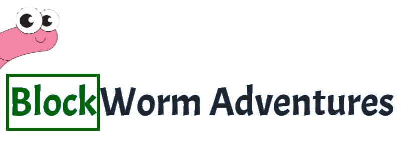

___

Milestone Project 2 - Interactive Frontend Development - Code Institute

Blockworm Adventure is a game designed to provide a updated version of the old but loved snake
game, with better graphics and some new unexpected twists to experience the game again with 

## UX
The website/game is designed in a simplistic manager so the visitors can easily try out the game
but also assist with further development with a built in feedback form API.

I also encourage the visitors to visit the code itself to make their feedback even more relevant.

Strong but not overwhelming colors have been chosen to emphasis on the simplicity.

## Features
- Feature 1: allows users to try them self at a new type of snake game by controlling the snake to capture as much food as possible.

- Feature 2: The games comes with multiple "food types", providing different twists and points each type.

- Feature 3: Once the player have finished the game by accidentally hitting the wall or the body of the snake, 
they get to see their highscore on a separate window.

- Feature 4: We welcome our players to provide feedback by visiting our feedback
section of the website, writing their thoughts on the game.   

#### Features Left to Implement

- Adding multiple maps.
- Including randomized fruit types and events.

## Technologies

| Languages  | Usage |
| ------------- | ------------- |
| HTML  | Create the foundation of the website  |
| CSS  | Applying styling and mobile size format  |
| Bootstrap  | Add styling and grid  |
| FontAwesome  | Importing website icons  |
| jQuery  | Apply interactivity and data storage  |
| JavaScript  | Add logic to the website and the game  |
| Google Fonts  | For all fonts on website  |

## Graphic design tools
| Tools  | Usage |
| ------------- | ------------- |
| [Krita](https://krita.org/en/)  | For designing all graphic content  |
| [Paint 3D](https://www.microsoft.com/en-ie/p/paint-3d/9nblggh5fv99?activetab=pivot:overviewtab)  | Pre-work on graphic content  |
| [Microsoft Paint](https://en.wikipedia.org/wiki/Microsoft_Paint)  | Rough graphic content  |

## API
For feedback I am using
[mailJS](https://www.emailjs.com/)

## Wireframe tools
Wireframe tool is
[Balsamiq](https://balsamiq.com/)

## Testing
#### This website have been tested for the following.

- Responsiveness
- Interactivity
- Logic
- HTML Validator
- CSS Validator

### Responsive testing in Chrome and FireFox
1: Landing Page, Feedback Page, Snake Game Page, Tutorial Page: 
These test were identical on all pages to ensure they are responsive to all device types. 
    
- Open all pages on fullscreen in Chrome, Firefox and Edge identify that they all look the same.   
- Used responsive slider to ensure the content is shown correctly, especially the media content that is designed to only work on desktop
- Tested to open the pages on all sizes available in Chrome, Firefox, but not Edge, as it only had Slider available.

  
  <ol>
  <li>360 x 640 Galaxy S5</li>
  <li>375 x 667 iPhone 6/7/8</li>
  <li>375 x 812 iPhone X</li>
  <li>411 x 731 Pixel 2</li>
  <li>411 x 823 Pixel 2 XL</li>
  <li>414 x 736 iPhone 6/7/8 Plus</li>
  <li>768 x 1024 iPad</li>
  <li>1024 x 1366 iPad Pro</li>
   </ol>
   
### Interaction testing in Chrome, Firefox and Edge
2: In this section we are testing if all the buttons and links are working correctly and
guide the user to the correct landing page, or displaying the right menus.
#### Landing Page
- Clicking on Tutorial from Landing page, expecting it to show the rules correctly.
- Clicking on Feedback, from Landing page expecting it to redirect us to Feedback correctly.
- Clicking on the close button in tutorial and have it close the modal window.
- Clicking on Code, from Landing page expecting it to redirect us to github project location correctly
- Hoovering over all the links to correctly display the styling used on hoovering.

#### Feedback Page
- Clicking on Tutorial from Feedback, displaying the rules correct.
- Clicking on the close button to close tutorial.
- Clicking Home link to redirect to home page correct.
- Clicking code link to have it direct us to the github project source.
- Hoovering over all the links to correctly display the styling used on hoovering.

#### Game Page
- Clicking on Tutorial from Game, displaying the rules correct.
- Clicking on the close button to close tutorial.
- Clicking Home link to redirect to home page correct.
- Clicking code link to have it direct us to the github project source.
- Hoovering over all the links to correctly display the styling used on hoovering.

### Logic Testing in Chrome, Firefox and Edge.
The importance of testing the logic of the website and the game across the browsers and devices
is to make sure that Javascript run correct on all popular browsers.

#### Landing page play button nickname logic
This page is not allowing the player to start the game, unless the username within 8 characters have been provided.
- Clicked Play with no nickname added, making it display "Type in a Nickname"
- Typing in a nickname above 8 characters long (past the max length), "making it display "Maximum 8 Characters"
- Typing in 6 Characters, allowing player to enter game.

#### Feedback logic

## Demo
Try the game here: https://pyleks.github.io/milestone-project-two/

Repo: https://github.com/Pyleks/milestone-project-two.git

