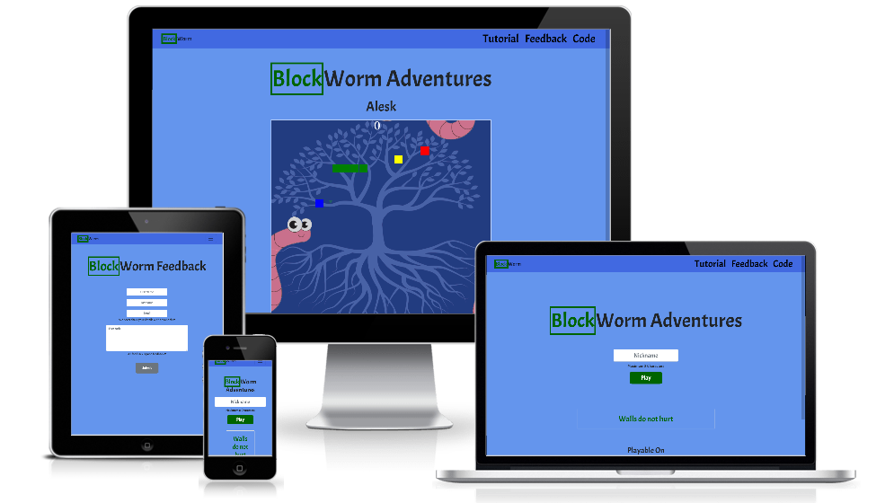

___

Milestone Project 2 - Interactive Frontend Development - Code Institute

Blockworm Adventure is a game designed to provide a updated version of the old but loved snake
game, with better graphics and some new unexpected twists to experience the game again with improved controls
for desktop/laptop tablets and phones.

## UX
This website/game have been designed to easily pull in the visitor to kill some time by trying out a brand new
snake game.

1. **Playing** is the number one emphasis on the website, drawing in the user, and let them try out a
traditional snake game.
2. **Open Source** is the backbone of the development the BlockWorm Adventures, I have provided the means to let the visitor see the code that runs the game
so they can assist with further development through the feedback section.
3. **Cross Compatibility** Enjoy the game? why only play it on your desktop, also take it with you on  the bus, in the car,
everywhere with cross compatibility built right into the game.

### User Stories
> Browsing different browser games to kill some time.  

> Looking for a snake game recently developed to have fun.  

> Sitting on the bus, looking for a game to kill some time.  

> As a developer I want to find a open source game to help out on.

> As a user I want to visit different browser games, and happen to come upon this.

### Wireframes
[Desktop Wireframes](https://github.com/Pyleks/milestone-project-two/blob/master/assets/wireframes/Desktop%20Wireframes.pdf)  
[Tablet Wireframes](https://github.com/Pyleks/milestone-project-two/blob/master/assets/wireframes/Tablet%20Wireframes.pdf)  
[Smartphone Wireframes](https://github.com/Pyleks/milestone-project-two/blob/master/assets/wireframes/Smartphone%20Wireframes.pdf)  
[Game over overlay Wireframe](https://github.com/Pyleks/milestone-project-two/blob/master/assets/wireframes/Gameover%20Overlay%20Wireframe.pdf)  
[Tutorial all sizes Wireframe](https://github.com/Pyleks/milestone-project-two/blob/master/assets/wireframes/Tutorial%20all%20sizes%20Wireframe.pdf)  

## Features
- Feature 1: allows users to try them self at a new type of snake game by controlling the snake to capture as much food as possible.

- Feature 2: The games comes with multiple "food types", providing different twists and points each type.

- Feature 3: Once the player have finished the game by accidentally hitting the wall or the body of the snake, 
they get to see their highscore on a separate window.

- Feature 4: We welcome our players to provide feedback by visiting our feedback
section of the website, writing their thoughts on the game.   

#### Features Left to Implement

- Adding multiple maps.
- Including randomized fruit types and events.

## Technologies

| Languages  | Usage |
| :------------- | :------------- |
| [HTML](https://www.w3schools.com/html/)  | Create the foundation of the website  |
| [CSS](https://www.w3schools.com/css/)  | Applying styling and mobile size format  |
| [JavaScript](https://www.w3schools.com/js/)  | Add logic to the website and the game  |

## Libraries

|Libraries  |Usage  |
| :-------------| :-------------|
| [Bootstrap](https://getbootstrap.com/)  | Add styling and grid  |
| [Font Awesome](https://fontawesome.com/)  | Importing website icons  |
| [jQuery](https://jquery.com/) | Apply interactivity and data storage  |
| [Google Fonts](https://fonts.google.com/) | For all fonts on website  |

## Graphic design tools
| Tools  | Usage |
| :------------- | :------------- |
| [Krita](https://krita.org/en/)  | For designing all graphic content  |
| [Paint 3D](https://www.microsoft.com/en-ie/p/paint-3d/9nblggh5fv99?activetab=pivot:overviewtab)  | Pre-work on graphic content  |
| [Microsoft Paint](https://en.wikipedia.org/wiki/Microsoft_Paint)  | Rough graphic content  |

## API
For feedback I am using
[mailJS](https://www.emailjs.com/)

## Wireframe tools
Wireframe tool is
[Balsamiq](https://balsamiq.com/)

## Testing
#### This website have been tested for the following.

- Responsiveness
- Interactivity
- Logic
- HTML Validator
- CSS Validator

### Responsive testing in Chrome and FireFox
1: Landing Page, Feedback Page, Snake Game Page, Tutorial Page: 
These test were identical on all pages to ensure they are responsive to all device types. 
    
- Open all pages on fullscreen in Chrome, Firefox and Edge identify that they all look the same.   
- Used responsive slider to ensure the content is shown correctly, especially the media content that is designed to only work on desktop
- Tested to open the pages on all sizes available in Chrome, Firefox, but not Edge, as it only had Slider available.

  
  <ol>
  <li>360 x 640 Galaxy S5</li>
  <li>375 x 667 iPhone 6/7/8</li>
  <li>375 x 812 iPhone X</li>
  <li>411 x 731 Pixel 2</li>
  <li>411 x 823 Pixel 2 XL</li>
  <li>414 x 736 iPhone 6/7/8 Plus</li>
  <li>768 x 1024 iPad</li>
  <li>1024 x 1366 iPad Pro</li>
   </ol>
   
### Interaction testing in Chrome, Firefox and Edge
2: In this section we are testing if all the buttons and links are working correctly and
guide the user to the correct landing page, or displaying the right menus.
#### Landing Page
- Clicking on Tutorial from Landing page, expecting it to show the rules correctly.
- Clicking on Feedback, from Landing page expecting it to redirect us to Feedback correctly.
- Clicking on the close button in tutorial and have it close the modal window.
- Clicking on Code, from Landing page expecting it to redirect us to github project location correctly
- Hoovering over all the links to correctly display the styling used on hoovering.

#### Feedback Page
- Clicking on Tutorial from Feedback, displaying the rules correct.
- Clicking on the close button to close tutorial.
- Clicking Home link to redirect to home page correct.
- Clicking code link to have it direct us to the github project source.
- Hoovering over all the links to correctly display the styling used on hoovering.

#### Game Page
- Clicking on Tutorial from Game, displaying the rules correct.
- Clicking on the close button to close tutorial.
- Clicking Home link to redirect to home page correct.
- Clicking code link to have it direct us to the github project source.
- Hoovering over all the links to correctly display the styling used on hoovering.

### Logic Testing in Chrome, Firefox and Edge.
3: The importance of testing the logic of the website and the game across the browsers and devices
is to make sure that Javascript run correct on all popular browsers.

#### Landing page play button nickname logic
This page is not allowing the player to start the game, unless the username within 8 characters have been provided.
- Clicked Play with no nickname added, making it display "Type in a Nickname"
- Typing in a nickname above 8 characters long (past the max length), "making it display "Maximum 8 Characters"
- Typing in 6 Characters, allowing player to enter game.

#### Feedback logic test
To provide feedback, the user must fill inn all the fields to be able to submit the form.

- Added only first name, and attempted to submit.
- Added only last name, and attempted to submit.
- Added only email, and attempted to submit.
- Added only feedback, and attempted to submit.
- Added first name, last name and feedback and attempted to submit.
- Did not add anything and attempted to submit.
- Added everything and attempted to submit.
- Added first name, last name and email and attempted to submit.

#### Game page logic test
For the game to run successful the points must accumulate correct, the controls for desktop/laptop and devices must work correct as well
scoring bord must collect the scores.
- Attempted to eat all 3 different apples, expecting the score to go up by 3.
- Tried UP, DOWN, LEFT and RIGHT on keyboard.
- Tried UP, DOWN, LEFT and RIGHT on mobile controls for both tablet and mobile device and table.
- Tried UP, then DOWN to see if the snake would collide with itself on desktop.
- Tried UP, then DOWN to see if the snake would collide with itself on and mobile device and table.
- Killed the snake to display scoreboard.
- Killed the snake 10 times to see if the scoreboard would out grow the allocated score board size.
- Tried clicking new game.
- Tried to move the snake outside of the border on each side, and top/down.

## Testing Summary

### Responsiveness
| Page        | Bugs           | Status  |
|:------------- |:-------------| :-----:|
| Landing Page     | One issue with scaling was found, where it did not remove desktop icons in time. | No |
| Feedback Page     | The form did not scale correct from 577px width.      |   No |
| Game Page | Above 1025px width the game scaled incorrectly and removing the controls too early     |    No |

### Interactivity
| Page        | Bugs           | Status  |
|:------------- |:-------------| :-----:|
| Landing Page     | No Bugs | Good |
| Feedback Page     | No Bugs       |   Good |
| Game Page | No Bugs      |    Good |

### Logic
| Page        | Bugs           | Status  |
|:------------- |:-------------| :-----:|
| Landing Page     | No Bugs | Good |
| Feedback Page     | No Bugs       |   Good |
| Game Page | If the player continue playing, the nickname and score outgrow the scoreboard.      |    No |
| Game Page | The scores are not sorted correctly from highest to lowest score.      |    No |
| Game Page | Bug with snake moving into it's own body when moving from right to left, left to right, up to down or down to up.      |    Fixed |

### HTML Validator
| Page        | Bugs           | Status  |
|:------------- |:-------------| :-----:|
| All Pages     | Reoccurring image tag missing on all pages | Fixed |
| All Pages     |  Wrong type on (a) tag       |   Fixed |
| All pages | Stray a tag that did not close anything      |    Fixed |

### CSS Validator
| Page        | Bugs           | Status  |
|:------------- |:-------------| :-----:|
| style.css     | No Bugs | Good |

## Demo
Try the game here: https://pyleks.github.io/milestone-project-two/

Repo: https://github.com/Pyleks/milestone-project-two.git

