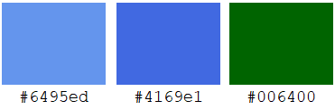

___

Milestone Project 2 - Interactive Frontend Development - Code Institute

Blockworm Adventure is a game designed to provide an updated version of the old but loved snake
game, with better graphics and some new unexpected twists to experience the game again with improved controls
for desktop/laptop tablets and phones.

## UX
This website/game have been designed to easily pull in the visitor to kill some time by trying out a brand new
snake game.

1. **Playing** is the number one emphasis on the website, drawing in the user, and let them try out a
traditional snake game.
2. **Open Source** is the backbone of developing BlockWorm Adventures, I have provided the means to let the visitor see the code that runs the game
so they can assist with further development through the feedback section.
3. **Cross Compatibility** Enjoy the game? why only play it on your desktop, also take it with you on  the bus, in the car,
everywhere with cross compatibility built right into the game.

### User Stories
> Browsing different browser games to kill some time.  

> Looking for a snake game that recently got developed to have fun. 

> Sitting on the bus, looking for a game to kill some time.  

> As a developer I want to find an open source game to help with.

> As a user I want to visit different browser games and happen to come upon this.

### Wireframes
[Desktop Wireframes](https://github.com/Pyleks/milestone-project-two/blob/master/assets/wireframes/Desktop%20Wireframes.pdf)  
[Tablet Wireframes](https://github.com/Pyleks/milestone-project-two/blob/master/assets/wireframes/Tablet%20Wireframes.pdf)  
[Smartphone Wireframes](https://github.com/Pyleks/milestone-project-two/blob/master/assets/wireframes/Smartphone%20Wireframes.pdf)  
[Game Over overlay Wireframe](https://github.com/Pyleks/milestone-project-two/blob/master/assets/wireframes/Gameover%20Overlay%20Wireframe.pdf)  
[Tutorial all sizes Wireframe](https://github.com/Pyleks/milestone-project-two/blob/master/assets/wireframes/Tutorial%20all%20sizes%20Wireframe.pdf)  

## Design Decisions

#### Color Scheme    
   
These were the main colours due to the simplicity of the website,
making them go well together, as well making the green stand out in the light blue.
as well working excellent with the navigation bar hoover colour.

#### Overall Simple Design
Following less is more, making all the right elements stand out, so the visitor knows exactly
what they see and where to go the moment they open the website.

## Features  
#### Existing Features
- Feature 1: Allow the user to try a more up to date cross platform snake game.
- Feature 2: Multiple food types for different points and growth to the snake.
- Feature 3: Open source development, allowing players to contribute in a more meaningful way.
- Feature 4: Fully working feedback form to pass on suggestions directly to my email.

#### Features Left to Implement
- Random events, to offer a more unexpected gameplay.
- More maps.
- Better handling of score.
- Option to play at different speeds for the snake to provide different difficulty.

#### Planned Features
- Updating the method for handling user points.
- Link the game up to an online database so players can fight against each other to get the best score.

## Demo
Try the game here: https://pyleks.github.io/milestone-project-two/

## Technologies

### Languages
| Languages  | Usage |
| :------------- | :------------- |
| [HTML](https://www.w3schools.com/html/)  | Create the foundation of the website.  |
| [CSS](https://www.w3schools.com/css/)  | Applying styling and mobile size format.  |
| [JavaScript](https://www.w3schools.com/js/)  | Add logic to the website and the game.  |

### Libraries

|Libraries  |Usage  |
| :-------------| :-------------|
| [Bootstrap](https://getbootstrap.com/)  | Add styling and grid.  |
| [Font Awesome](https://fontawesome.com/)  | Importing website icons.  |
| [jQuery](https://jquery.com/) | Apply interactivity and data storage.  |
| [Google Fonts](https://fonts.google.com/) | For all fonts on website.  |

### Graphic design tools
| Tools  | Usage |
| :------------- | :------------- |
| [Krita](https://krita.org/en/)  | For designing all graphic content.  |
| [Paint 3D](https://www.microsoft.com/en-ie/p/paint-3d/9nblggh5fv99?activetab=pivot:overviewtab)  | Pre-work on graphic content.  |
| [Microsoft Paint](https://en.wikipedia.org/wiki/Microsoft_Paint)  | Rough graphic content.  |

### API
For feedback I am using
[mailJS](https://www.emailjs.com/).

### Wireframe tools
Wireframe tool is
[Balsamiq](https://balsamiq.com/).

## Testing
#### This website has been tested for the following

- Responsiveness
- Interactivity
- Logic
- JSHint
- HTML Validator
- CSS Validator

### Responsive testing in Chrome and FireFox
1: Landing Page, Feedback Page, Snake Game Page, Tutorial Page: 
These tests were identical on all pages to ensure they are responsive to all device types. 
    
- Open all pages in full screen within Chrome, Firefox and Edge, identify that they all look the same.   
- Used responsive slider to ensure that the content is shown correctly, especially the media content that is designed to only work on desktop.
- Tested to open the pages on all sizes available in Chrome, Firefox, but not Edge, as it only had Slider available.

  
  <ol>
  <li>360 x 640 Galaxy S5</li>
  <li>375 x 667 iPhone 6/7/8</li>
  <li>375 x 812 iPhone X</li>
  <li>411 x 731 Pixel 2</li>
  <li>411 x 823 Pixel 2 XL</li>
  <li>414 x 736 iPhone 6/7/8 Plus</li>
  <li>768 x 1024 iPad</li>
  <li>1024 x 1366 iPad Pro</li>
   </ol>
   
### Interaction testing in Chrome, Firefox and Edge
2: In this section we are testing if all the buttons and links are working correctly and
guide the user to the correct landing page, or displaying the right menus.
#### Landing Page
- Clicking on tutorial from landing page, expecting it to show the rules correctly.
- Clicking on feedback, from landing page expecting it to redirect us to Feedback correctly.
- Clicking on the close button in tutorial and have it close the modal window.
- Clicking on code, from landing page expecting it to redirect us to GitHub project location correctly.
- Hoovering over all the links to correctly display the styling used on hoovering.

#### Feedback Page
- Clicking on tutorial from feedback, displaying the rules correct.
- Clicking on the close button to close tutorial.
- Clicking home link to redirect to home page correct.
- Clicking code link to have it direct us to the GitHub project source.
- Hoovering over all the links to correctly display the styling used on hoovering.

#### Game Page
- Clicking on tutorial from the game, displaying the rules correct.
- Clicking on the close button to close tutorial.
- Clicking home link to redirect to home page correct.
- Clicking code link to have it direct us to the GitHub project source.
- Hoovering over all the links to correctly display the styling used on hoovering.

### Logic Testing in Chrome, Firefox and Edge.
3: The importance of testing the logic of the website and the game across the browsers and devices
is to make sure that JavaScript runs correct on all popular browsers.

#### Landing page play button nickname logic
This page is not allowing the player to start the game, unless a username within 8 characters have been provided.
- Clicked Play with no nickname added, making it display "Type in a Nickname".
- Typing in a nickname above 8 characters long (past the max length), "making it display "Maximum 8 Characters".
- Typing in 6 Characters, allowing player to enter game.

#### Feedback logic test
To provide feedback, the user must fill inn all the fields to be able to submit the form.

- Added only first name and attempted to submit.
- Added only last name and attempted to submit.
- Added only email and attempted to submit.
- Added only feedback and attempted to submit.
- Added first name, last name and feedback and attempted to submit.
- Did not add anything and attempted to submit.
- Added everything and attempted to submit.
- Added first name, last name and email and attempted to submit.

#### Game page logic test
For the game to run successful the score must accumulate correct, the controls for desktop/laptop and devices must work correct as well
scoring bord must collect the scores.
- Attempted to eat all 3 different apples, expecting the score to go up by 3.
- Tried UP, DOWN, LEFT and RIGHT on keyboard.
- Tried UP, DOWN, LEFT and RIGHT on mobile controls for both tablet and mobile device and table.
- Tried UP, then DOWN to see if the snake would collide with itself on desktop.
- Tried UP, then DOWN to see if the snake would collide with itself on and mobile device and table.
- Killed the snake to display scoreboard.
- Killed the snake 10 times to see if the scoreboard would outgrow the allocated score board size.
- Tried clicking new game.
- Tried to move the snake outside of the border on each side, and top/down.

### JSHint Test
This was tested to make sure the JavaScript code did not have any major unnoticed flaws.
- Copy/Pasted email.js
- Copy/Pasted global_JS.js
- Copy/Pasted script.js
- Copy/Pasted snake2.0.js

## Testing Summary

### Responsiveness
| Page        | Bugs           | Status  |
|:------------- |:-------------| :-----:|
| Landing Page     | One issue with scaling was found, where it did not remove desktop icons in time. | Fixed |
| Feedback Page     | The form did not scale correct from 577px width.      | Not Fixed |
| Feedback Page | Footer causing issues in mobile view when typing feedback, due to it appearing mid screen when using keyboard.  | Not Fixed |
| Game Page | Above 1025px width the game scaled incorrectly and removing the controls too early.     | Not Fixed |
| Game Page | On some smaller desktop screens the canvas becomes too big.     | Not Fixed |

### Interactivity
| Page        | Bugs           | Status  |
|:------------- |:-------------| :-----:|
| Landing Page     | No Bugs. | Good |
| Feedback Page     | No Bugs.       |   Good |
| Game Page | No Bugs.      |    Good |

### Logic
| Page        | Bugs           | Status  |
|:------------- |:-------------| :-----:|
| Landing Page     | No Bugs. | Good |
| Feedback Page     | No Bugs.       |   Good |
| Game Page | If the player continue playing, the nickname and score outgrow the scoreboard.      | Not Fixed |
| Game Page | The scores are not sorted correctly from highest to lowest score.      |    Not Fixed |
| Game Page | Bug with snake moving into it's own body when moving from right to left, left to right, up to down or down to up.      |    Fixed |

### JSHint
| Page        | Bugs           | Status  |
|:------------- |:-------------| :-----:|
| email.js     | No Bugs. | Good |
| global_JS.js     | Missing semicolon       |   Fixed |
| script.js | No Bugs.      | Good |
| snake2.0.js |  Missing semicolon     |   Fixed |

### HTML Validator
| Page        | Bugs           | Status  |
|:------------- |:-------------| :-----:|
| All Pages     | Reoccurring image tag missing on all pages. | Fixed |
| All Pages     |  Wrong type on (a) tag.       |   Fixed |
| All pages | Stray a tag that did not close anything.      |    Fixed |

### CSS Validator
| Page        | Bugs           | Status  |
|:------------- |:-------------| :-----:|
| style.css     | No Bugs. | Good |

#### Remaining issues
> All remaining issues that have not been fixed, was due to lack of time to fix them, or lack of knowledge on how to fix them in time.

## Deployment
Steps to deploy the website from GitHub.
1. Go to [GitHub](https://github.com/Pyleks).
2. Click Repositories.
3. Locate milestone-project-two.
4. Open the repository [milestone-project-two](https://github.com/Pyleks/milestone-project-two)
5. Click Settings.
6. Scroll down to GitHub Pages.
7. Select Master branch under Source.  
8. Site Deployed under URL: https://pyleks.github.io/milestone-project-two/.

#### How to clone this website
1. Go to [GitHub](https://github.com/Pyleks).
2. Click Repositories.
3. Locate milestone-project-two.
4. Open the repository [milestone-project-two](https://github.com/Pyleks/milestone-project-two).
5. Click the green button clone or download.
6. Clone from displayed URL: https://github.com/Pyleks/milestone-project-two.git.
7. Clone with following command in terminal <code>git clone https://github.com/Pyleks/milestone-project-two.git</code>.
8. Remove connection from repository with the following command in the terminal <code>git remote rm origin</code>.

## Credits
#### Snake Game Origin Code
This game was only possible thanks to GitHub user [Straker](https://gist.github.com/straker/ff00b4b49669ad3dec890306d348adc4)     
The code have been marked with A.A for all code done by me.

#### Honourable mention
Snake game made by YouTuber [Code Explained](https://www.youtube.com/watch?v=9TcU2C1AACw) provided some crucial mathematical randomize in the snake code.

#### Touch Screen Controls
This was improved upon immensely by Aaron Sinnott (Mentor).

#### Responsive README image
Was only possible thanks to [am.i.responsive](http://ami.responsivedesign.is/).

#### CSS Reset
Was acquired from github account from [DavidWells](https://gist.github.com/DavidWells/18e73022e723037a50d6)
which was modified version from the original [meyerweb](https://meyerweb.com/eric/tools/css/reset/).

#### Looping Text
This code was acquired from [stackoverflow](https://stackoverflow.com/questions/50495797/how-to-loop-changing-text-with-html-js)  
and modified for my project.

#### Icons
The 3 icons is from [Font Awesome](https://fontawesome.com/).   

#### Font
The font used on this website is from [Google Fonts](https://fonts.google.com/) from font family [Acme](https://fonts.google.com/?query=Acme).

## Licensed and purchased Images 

[Snake Image ](https://www.shutterstock.com/image-vector/earth-worm-cartoon-outlined-character-black-452659024)  
[Tree Image](https://www.shutterstock.com/image-vector/tree-silhouette-root-489511564)

These 2 images are used for logos and game background.

